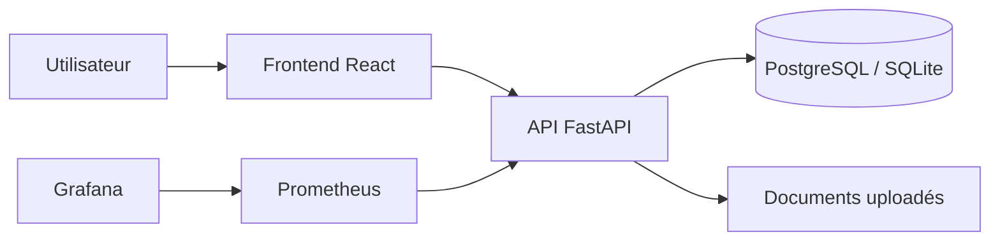
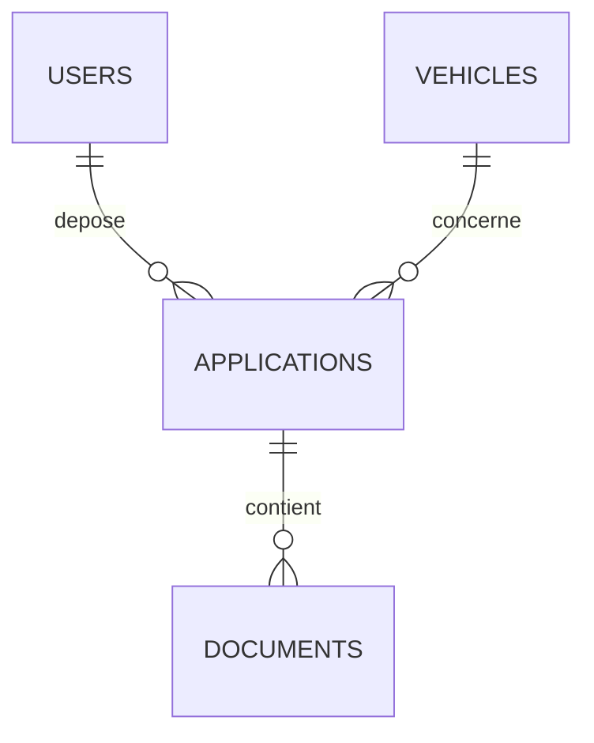

# Dossier technique — M-Motors Bloc 3

## 1. Contexte

M-Motors souhaite refondre son application web afin d'ajouter une offre de location longue durée avec option d'achat. La solution développée couvre le catalogue, le dépôt de dossier, le suivi client, le back-office, la sécurité, les tests et la supervision.

## 2. Stack

- Frontend : React + Vite
- Backend : Python FastAPI
- ORM : SQLAlchemy
- Base locale : SQLite
- Base cible : PostgreSQL
- Sécurité : JWT, hash PBKDF2, rôles USER / ADMIN
- Tests : Pytest + pytest-cov
- Conteneurisation : Docker Compose
- Supervision : `/health`, `/metrics`, Prometheus, Grafana, UptimeRobot compatible

## 3. Architecture logicielle



## 4. Modèle de données



## 5. User Stories livrées

- US1 : Consulter le catalogue de véhicules — DONE
- US2 : Filtrer achat/location — DONE
- US3 : Se connecter avec email/mot de passe — DONE
- US4 : Déposer un dossier — DONE
- US5 : Ajouter des justificatifs PDF/JPG/PNG — DONE
- US6 : Télécharger les justificatifs — DONE
- US7 : Suivre le statut du dossier — DONE
- US8 : Ajouter un véhicule côté admin — DONE
- US9 : Basculer achat/location — DONE
- US10 : Valider ou refuser un dossier — DONE
- US11 : Consulter logs et monitoring — DONE

## 6. Git et branches

Stratégie proposée :

- `main` : version stable
- `develop` : intégration
- `fonctionnalite-authentification`  : développement de l'authentification et de la gestion des accès

Les fonctionnalités ont ensuite été intégrées progressivement dans la branche principale après validation.


## 7. Sécurité

- JWT avec expiration.
- Hash PBKDF2 des mots de passe.
- Contrôle d'accès par rôle.
- Validation Pydantic des entrées.
- Contrôle MIME et taille des pièces jointes.
- Téléchargement de documents protégé par token.
- CORS configurable par variable d'environnement.

## 8. RPO / RTO

- RPO : 15 minutes.
- RTO : 1 heure.

Ces valeurs sont cohérentes avec une application commerciale où les dossiers clients sont importants mais où une restauration sous une heure reste acceptable en cas d'incident.

## 9. Monitoring et alerting

- `/health` : vérifie API + BDD.
- `/metrics` : métriques Prometheus.
- `/admin/logs` : logs applicatifs côté admin.
- `/health/alert-test` : simulation d'alerte.
- UptimeRobot peut surveiller `/health`.
- Grafana peut afficher les métriques via Prometheus.

## 10. Tests

Commande :

```bash
pytest --cov=app --cov-report=term-missing
```

Résultat validé :

- 6 tests passés.
- Couverture : 86 %.

## 11. Déploiement

### Local

- Backend FastAPI sur `localhost:8000`.
- Frontend Vite sur `localhost:5173`.

### Docker Compose

- PostgreSQL
- API FastAPI
- Frontend React
- Prometheus
- Grafana

### Cloud recommandé

- Frontend : Vercel
- Backend : Render
- Base de données : SQLite
- Monitoring : UptimeRobot + Grafana
